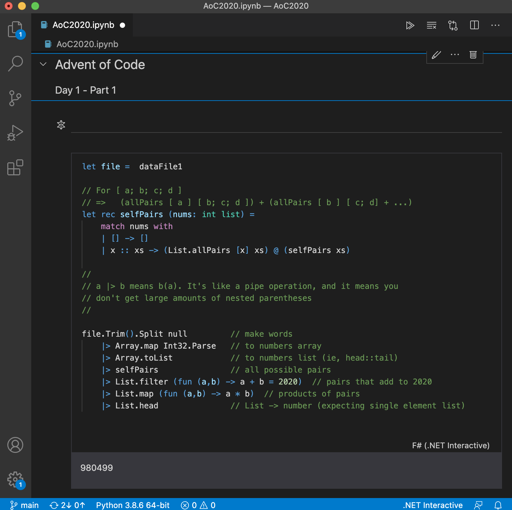

# Advent of Code 2020

I've decided to attempt the whole thing inside an Interactive Notebook using F#. Enjoying it very much so far!



Find out more https://devblogs.microsoft.com/dotnet/net-interactive-preview-3-vs-code-insiders-and-polyglot-notebooks/

Ironically, you can't see my code unless you download the Notebook and run it inside Interactive, so here are my code fragments

## Day 1 (part 1)

```fsharp
// For [ a; b; c; d ]
// =>   (allPairs [ a ] [ b; c; d ]) + (allPairs [ b ] [ c; d] + ...)
let rec selfPairs (nums: int list) =
    match nums with
    | [] -> []
    | x :: xs -> (List.allPairs [x] xs) @ (selfPairs xs)

//
// a |> b means b(a). It's like a pipe operation, and it means you
// don't get large amounts of nested parentheses
//

dataFile1.Trim().Split null         // make words
    |> Array.map Int32.Parse   // to numbers array
    |> Array.toList            // to numbers list (ie, head::tail)
    |> selfPairs               // all possible pairs 
    |> List.filter (fun (a,b) -> a + b = 2020)  // pairs that add to 2020
    |> List.map (fun (a,b) -> a * b)  // products of pairs
    |> List.head               // List -> number (expecting single element list)

```

## Day 1 (part 2)

```fsharp
// For [ a; b; c; d ]
// =>   (allPairs [ a ] [ b; c; d ]) + (allPairs [ b ] [ c; d] + ...)
let rec selfPairs (nums: int list) =
    match nums with
    | [] -> []
    | x :: xs -> (List.allPairs [x] xs) @ (selfPairs xs)

//
// We could flatten the resulting  (float, (float,float))
// value into an array, but I'll resist. 
//
// That would be useful though, since it means the sum filter could map (+) across 
// that array and the result calculation could map (*) across the matching array
//
let rec selfTriples (nums: int list) : (int*(int*int)) list  =
    match nums with
    | [] -> []
    | x :: xs -> (List.allPairs [ x ] (selfPairs xs)) @ (selfTriples xs)

dataFile1.Trim().Split null         // make words
    |> Array.map Int32.Parse   // to numbers array
    |> Array.toList            // to numbers list (ie, head::tail)
    |> selfTriples             // all possible triples 
    |> List.filter (fun (a,(b,c)) -> a + b + c = 2020)  // pairs that add to 2020
    |> List.map (fun (a,(b,c)) -> a * b * c)  // products of pairs
    |> List.head               // List -> number (expecting single element list)
```

## Day 2 (part 1)

```fsharp
type Rule = {
    Min : int
    Max : int
    Letter : char
}

type Entry = {
    Rule : Rule
    Password : string
}

let parseRule (text : string) =
    let tokens = text.Split()
    let minMax = tokens.[0].Split('-');
    {
        Min = Int32.Parse(minMax.[0])
        Max = Int32.Parse(minMax.[1])
        Letter = tokens.[1].[0]
    }

let isValid (entry : Entry) =
    let n = entry.Password.ToCharArray() |> Array.filter ((=) entry.Rule.Letter) |> Array.length
    n >= entry.Rule.Min && n <= entry.Rule.Max

dataFile2.Split('\n',StringSplitOptions.RemoveEmptyEntries)
    |> Array.map (fun line -> 
        let rulePassword = line.Split(':')
        { Rule = parseRule( rulePassword.[0] ); Password = rulePassword.[1].Trim() }
    )
    |> Array.filter isValid
    |> Array.length
```

## Day 2 (part 2)

```fsharp
type Rule = {
    Min : int
    Max : int
    Letter : char
}

type Entry = {
    Rule : Rule
    Password : string
}

let parseRule (text : string) =
    let tokens = text.Split()
    let minMax = tokens.[0].Split('-');
    {
        Min = Int32.Parse(minMax.[0])
        Max = Int32.Parse(minMax.[1])
        Letter = tokens.[1].[0]
    }

let isValid (entry : Entry) =
    let n = entry.Password.ToCharArray() |> Array.filter ((=) entry.Rule.Letter) |> Array.length
    n >= entry.Rule.Min && n <= entry.Rule.Max

dataFile2.Split('\n',StringSplitOptions.RemoveEmptyEntries)
    |> Array.map (fun line -> 
        let rulePassword = line.Split(':')
        { Rule = parseRule( rulePassword.[0] ); Password = rulePassword.[1].Trim() }
    )
    |> Array.filter isValid
    |> Array.length
```
